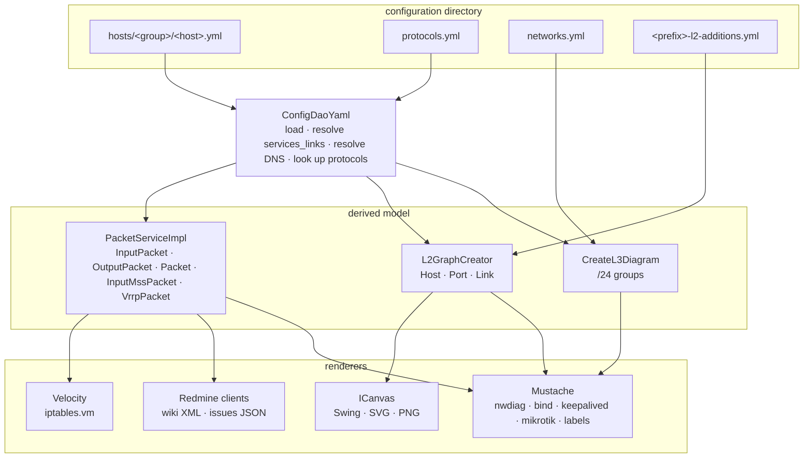

Every generator is the same three-stage pipeline: load the description into memory, derive a model of
what traffic is permitted, render that model through a template. Only the last stage differs between
commands.

## The pipeline

### Stage 1 — load

`ConfigDaoYaml` reads the whole description into memory in its constructor. It walks `hosts/`
recursively, stamps each host's `name` and `group` from the filesystem, then does the work that makes
the later stages simple:

- **`services_links` resolution** — builds a global map of `name` → service and appends the referenced
  definitions to each linking host, rejecting duplicate names and duplicate URLs.
- **`protocols.yml` validation** — every protocol must have a non-null `protocol` and a non-zero `port`.
- **DNS resolution** — `resolveDns` scans every interface's `dns:` and every `vips.names` in the
  configuration; a name mapping to two different addresses is rejected.
- **Topology queries** — `findHostByGw` inverts the `gw` relation; `findLinkedInterface` resolves a
  `link:` to the interface at the other end, rejecting a cable declared from both sides.

Because all of this happens in the constructor, **every** command validates the whole description on
startup, even commands that only need part of it. That is why the generators double as a linter.

### Stage 2 — derive

`PacketServiceImpl` is the core, and the only place firewall semantics live. It answers six questions
per host, each independently:

| Method | Produces |
|---|---|
| `getInputPackets` | traffic terminating on this host |
| `getOutputPackets` | traffic this host initiates, because it appears in somebody's `access:` |
| `getForwardPackets` | traffic this host routes, plus the SNAT/DNAT decision |
| `getInputMssPackets` | TCPMSS clamps from `mss:` on a source interface |
| `getVrrpPackets` / `getLinkedVrrpPackets` | local ↔ remote VRRP pairs |
| `getCustomRules(host, chain)` | verbatim rules for one chain |

The intermediate vocabulary is small: an `Access` is one resolved `(host, serviceName)` pair; a
`ServiceInfo` is a `TService` with its protocol, port and address resolved; a `UrlInfo` is a parsed
`url:` or `nat:`. See [Rule derivation](/firewall-config/internals/packet-derivation/).

The L2 and L3 sides have their own, simpler derivations — `L2GraphCreator` builds a port-and-cable graph
from `link:`/`port:`/`vlan:`, `CreateL3Diagram` buckets interface addresses into `/24`s and names them
from `networks.yml`.

### Stage 3 — render

Nothing in stages 1–2 knows about output formats. Four rendering mechanisms sit on top:

| Mechanism | Templates | Used for |
|---|---|---|
| Velocity | `iptables.vm` | the rule sets |
| Mustache | `nwdiag`, `bind-zone`, `bind-reverse-zone`, `bind-zones-conf`, `keepalived`, `mikrotik`, `host-labels.html`, `ethernet-labels.html` | everything textual |
| `ICanvas` | — | the L2 diagram, with `SwingCanvas` used for the editor, PNG and SVG alike |
| Redmine clients | textile built in `WikiServiceImpl` | wiki pages and issues, both over Redmine's JSON API |

`ICanvas` is worth noting: the same painting code drives the interactive editor, `ImageIO` and JFreeSVG,
which is why the SVG matches what you arranged on screen.

## Packages

| Package | Role |
|---|---|
| `com.payneteasy.firewall` | All 21 `Main*` entry points, one per generated artifact |
| `.shell` | `AbstractDirPrefixFilterCommand` — the shared picocli `<dir> <prefix> --filter` contract |
| `.dao` | `IConfigDao`, `ConfigDaoYaml` — loading and topology queries |
| `.dao.model` | `THost`, `TInterface`, `TService`, `TProtocol`, `TVirtualIpAddress`, `TBlockedIpAddress`, `TCustomRule`, `ChainType` — the YAML shape |
| `.service` | `IPacketService`, `IWikiService`, `ConfigurationException` |
| `.service.impl` | `PacketServiceImpl` (the rule engine), `WikiServiceImpl` (textile builder) |
| `.service.model` | Derived types: `Access`, `ServiceInfo`, `UrlInfo`, `LinkInfo`, and the packet classes |
| `.l3` | `CreateL3Diagram` |
| `.l2`, `.l2.editor*` | The L2 graph, its Swing editor, the canvas abstraction, position managers |
| `.l2.labels.wire` | Patch-cord label SVG composition |
| `.redmine`, `.redmine.impl` | Wiki client, issue client, file-store client — the two HTTP ones on `com.payneteasy.http-client` |
| `.podmancheck` | podman-security-bench result model and Redmine issue creation |
| `.critsoft` | Software-card parsing and the critical-software table |
| `.util` | `Networks` (/24 arithmetic), `Strings`, `Yamls` (the only place a snakeyaml `Yaml` is built), `VelocityBuilder`, `MustacheFilePrinter`, `ShellFilePrinter` |

## Design consequences

A few properties follow from this shape and are worth knowing:

- **Everything is in memory.** The whole description is loaded eagerly, so there is no incremental
  mode; generating one host's rules costs the same load as generating all of them. For estates of a few
  hundred hosts this is irrelevant.
- **The engine is pure.** Given the same description, the output is byte-identical apart from the
  generation timestamp — which is what makes diffing generated rule sets a useful review step.
- **Firewall semantics are in one file.** `PacketServiceImpl` is where "should this rule exist?" is
  decided; the templates only format. Any change of behaviour belongs there.
- **Validation is a side effect.** There is no separate `validate` command; running a generator is the
  check.

## Next

- [Rule derivation](/firewall-config/internals/packet-derivation/) — stage 2 in detail.
- [Limitations](/firewall-config/internals/limitations/) — where the abstractions leak.
