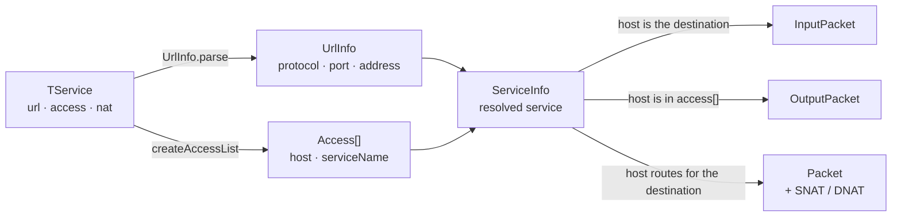
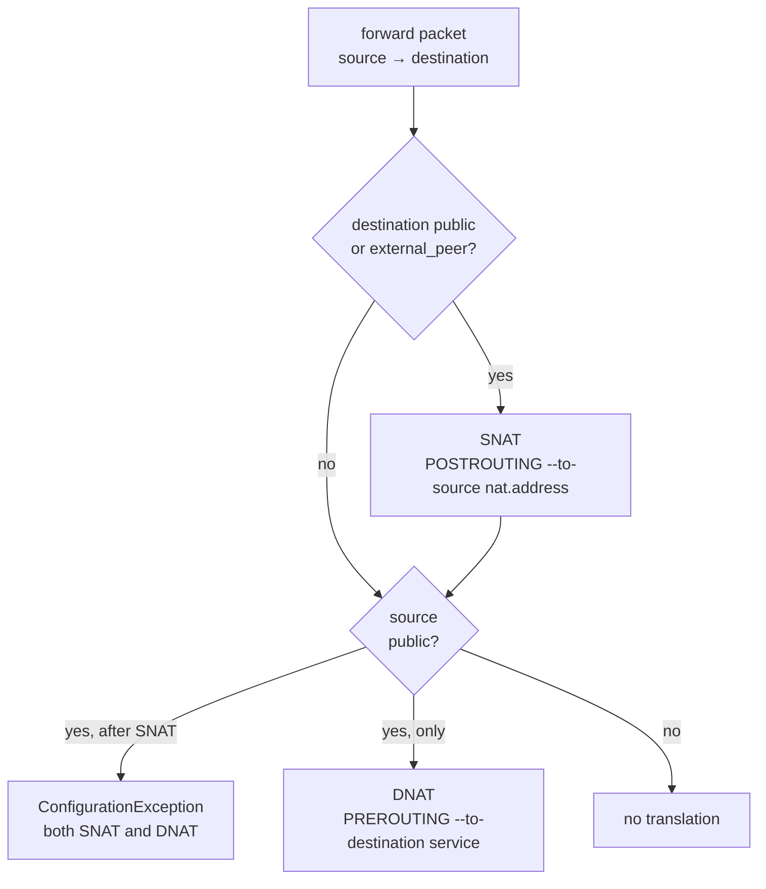

This is the algorithm behind every generated rule. All of it lives in `PacketServiceImpl`.

## From declaration to packet



The same service is looked at three times, from three different hosts' points of view. That is why one
declaration produces rules in several files at once and why no host ever has to mention another host's
services.

## INPUT — traffic terminating here

For each service on the host:

1. Parse `url:` into protocol, port and bind address, defaulting the address to the host's first real
   address.
2. Find which interface owns that address. If it is a `skip` interface, fail.
3. Expand `access:` into a list of `(host, serviceName)` pairs.
4. For each pair, pick the **source address** of that host with [`findAddress`](#findaddress).

Emitted as an `ACCEPT` pair — the `INPUT` rule and its stateful `OUTPUT` reply, since `OUTPUT` also
defaults to `DROP`.

## OUTPUT — traffic we initiate

Derived in reverse: iterate **every** service in the whole configuration, expand its `access:`, and keep
the entries naming this host. Nothing is declared on the initiating host at all — granting `web-1`
access to `db-1`'s PostgreSQL is what puts the outbound rule in `web-1`'s file.

## FORWARD — traffic we route

1. `findHostByGw(myInterfaces)` — every host whose `gw` is one of my addresses, real or virtual. These
   are the **destinations** I route for.
2. For each of their services, for each host in its `access:` (the **source**), consider the triple
   *source → me → destination*.
3. Apply the [suppression filters](#which-forward-packets-are-suppressed).
4. Find the input interface (the one holding the source's `gw`) and the output interface (the one holding
   the destination's `gw`). If they are the same interface, drop the packet — the traffic never crosses
   this host.
5. Decide [NAT](#snat-and-dnat).

A host with no dependents therefore has an empty FORWARD block, and a firewall gets its rules purely
from other hosts pointing their `gw` at it.

### Which FORWARD packets are suppressed

Six independent filters. Understanding them explains most "why is there no rule for X?" questions:

| Filter | Suppressed because |
|---|---|
| source == me | I do not forward my own traffic; that is OUTPUT. |
| source == destination | A host talking to itself never leaves it. |
| source and I both hold the destination's `gw` as a **`vip`** | We are a VRRP pair; neither routes for the other. |
| source has any address in the **same `/24`** as the destination *service address* | They talk directly; no router involved. |
| source and destination have a **common gateway** (one's `gw` is one of the other's addresses) | Directly adjacent. |
| input interface == output interface | The traffic does not cross me. |

The third and fourth are the ones that surprise people. In the demo network, `proxy-1` publishes its
resolver to `group-internal`, which includes `fw-2` — but `fw-1` gets no `fw-2 → proxy-1` FORWARD rule,
because both firewalls hold `10.20.2.1` as a `vip`. Likewise there is no rule for `web-1 → adm-1`: both
sit in `10.20.20.0/24`.

Note that the same-network test compares against the destination **service address**, not against all
of the destination's addresses — so a service pinned to a different interface of a multi-homed host is
handled correctly.

## SNAT and DNAT

Direction is never declared. It follows from which side is public, where *public* means: not `10.`,
not `172.16`, not `192.168`. A destination host carrying `external_peer: true` counts as public too —
that is how a partner behind a tunnel gets SNAT despite its RFC 1918 address.



- **SNAT** requires `nat:` on the destination service; without it the run fails with
  `Direction … wants to use NAT address but no NAT address was found`, which dumps the source host,
  the service and the destination host as YAML so you can see what was being resolved.
- **DNAT** requires `nat:` too — `No nat for service … at host …`.
- **Both** is not expressible: `Trying to config both SNAT and DNAT with …`.
- `external_peer` is read on the **destination** only. As a source, such a host is private like any
  other and produces no DNAT.

The NAT rule is a second projection of the same packet, so a translated flow appears in both `*filter`
and `*nat`.

## `findAddress`

When a source host has several addresses, which one goes in the rule? The one whose **binary prefix
shares the most leading bits** with the destination:

```java
// host with 10.0.4.1, 10.0.1.1, 10.0.102.1 …
findAddress("10.0.4.110", host)   // -> 10.0.4.1
findAddress("10.0.102.255", host) // -> 10.0.1.1
```

Single-interface hosts short-circuit to their default address, and a destination of `0.0.0.0/…` also
uses the default. This is the one piece of the engine with direct unit-test coverage
(`PacketServiceImplTest`).

It is a heuristic, not a routing lookup — it ignores netmasks and the actual route table, so a
multi-homed source in *neither* of the destination's networks can get the wrong leg. See
[Limitations](/firewall-config/internals/limitations/#findaddress-is-not-a-routing-lookup).

## MSS clamps

For each host in the configuration, for each of its services, for each of its interfaces carrying
`mss:` — if the target host is named **literally** in that service's `access:` list, emit a clamp:

```sh
-A INPUT -s 198.51.100.50 -p tcp -m tcp --tcp-flags SYN,RST SYN -j TCPMSS --set-mss 1300
```

The match is on the raw string, so `group-internal` and `adm-*` entries do **not** produce clamps — only
an exact host name does.

## VRRP

For every interface with a `vip` or `vips`, the paired interface on another host is located by matching
the virtual address. Three situations are rejected:

- no pair at all — `There no any additional virtual interface with ip address …`
- the address is another host's **real** address — `Virtual ip address … has pair with bare interface …`
- three or more holders — `There are two additional virtual addresses …`

The pairs feed the third FORWARD suppression filter and the keepalived generator. They are also passed
to `iptables.vm`, which currently ignores them — VRRP advertisements are not allowed by the generated
rules, so a `customRules` entry is needed for the `224.0.0.18` multicast if the chain policy would
otherwise drop it.

## Worked example

```yaml title="hosts/internal/db-1.yml"
gw: 10.20.22.1
interfaces:
- name: eth0
  ip:   10.20.22.21
services:
- url:    postgres
  name:   main-db
  access: [web-app.service, adm-1]
```

1. `url: postgres` → `tcp/5432` at `10.20.22.21` (the default address).
2. `access:` → `web-app.service` resolves to `web-1` (it declares `name: web-app`); `adm-1` is an exact
   host.
3. **`db-1`** gets INPUT rules from `10.20.20.21` and `10.20.20.31`.
4. **`web-1`** and **`adm-1`** get the matching OUTPUT rules.
5. `db-1.gw` is `10.20.22.1`, a `vip` on **`fw-1`** and **`fw-2`** — so both consider the flow. Source and
   destination are in different `/24`s and share no gateway, input interface (`eth0.202`) differs from
   output (`eth0.203`), so both get FORWARD rules.
6. Neither end is public, so no NAT.

One declaration, five files.

## Next

- [Limitations](/firewall-config/internals/limitations/) — where this leaks.
- [iptables](/firewall-config/generators/iptables/) — the rendered result.
